<div align="center">

<br />


<br />
<br />

# 🔥 Quanshi Video Surveillance System - NVR

Next-generation enterprise-grade intelligent video surveillance solution

<br />

<p align="center">
  <a href="https://github.com/2929004360/ruoyi-qs-nvr">
    
  </a>
  <a href="https://github.com/2929004360/ruoyi-qs-nvr/fork">
    
  </a>
</p>

<p align="center">
  <a href="https://github.com/2929004360/ruoyi-qs-nvr/releases">
    
  </a>
  <a href="https://github.com/2929004360/ruoyi-qs-nvr/blob/main/LICENSE">
    
  </a>
</p>

<p align="center">
  
  
  
  
  
  
</p>

<p align="center">
  <a href="../README.md">English</a> | 
  <a href="../README.zh-CN.md">中文</a>
</p>

<br />

</div>

---

## Project Introduction

Quanshi Video Surveillance System is a fully open-source enterprise-grade one-stop video surveillance solution, freely available for personal and enterprise use.

* **Backend**: Uses Spring Boot 3, Spring Cloud & Alibaba
* **Registry & Configuration**: Nacos registry, configuration center
* **Security**: Redis authentication
* **Traffic Control**: Sentinel traffic control
* **Distributed Transactions**: Seata distributed transactions
* **Streaming**: ZLMediaKit professional streaming server
* **Player**: EasyPlayer high-performance player

---

## Core Highlights

<div align="center">
  <table>
    <tr>
      <td align="center" style="padding: 20px; border: 2px solid #3b82f6; border-radius: 12px; margin: 10px;">
        <h3>🔗 GB28181 Cascade</h3>
        <p>Supports upper platform cascading, directory push, remote playback and PTZ control</p>
      </td>
      <td align="center" style="padding: 20px; border: 2px solid #10b981; border-radius: 12px; margin: 10px;">
        <h3>🚗 JT808/JT1078 Vehicle</h3>
        <p>Vehicle device access, location tracking, vehicle control, track playback</p>
      </td>
    </tr>
    <tr>
      <td align="center" style="padding: 20px; border: 2px solid #f59e0b; border-radius: 12px; margin: 10px;">
        <h3>🎮 Multi-Protocol</h3>
        <p>20+ protocol support, Hikvision/Dahua SDK support</p>
      </td>
      <td align="center" style="padding: 20px; border: 2px solid #ef4444; border-radius: 12px; margin: 10px;">
        <h3>📡 Streaming Cluster</h3>
        <p>Multiple ZLMediaKit nodes, load balancing, high availability</p>
      </td>
    </tr>
  </table>
</div>

---

## Project Address

* **Gitee**:
  * [ruoyi-qs-nvr](https://gitee.com/tangwenzhaoaini/ruoyi-qs-nvr) Backend Address
  * [ruoyi-qs-nvr-ui](https://gitee.com/tangwenzhaoaini/ruoyi-qs-nvr-ui) Frontend Address

* **GitHub**:
  * [ruoyi-qs-nvr](https://github.com/2929004360/ruoyi-qs-nvr) Backend Address
  * [ruoyi-qs-nvr-ui](https://github.com/2929004360/ruoyi-qs-nvr-ui) Frontend Address

---

## Features

### 🎬 1. Real-Time Video Surveillance
- ✅ **Multi-Screen Preview**: Supports 1/4/6/9/12/16/25 screen switching for various surveillance scenarios
- ✅ **Split Screen Control**: One-click clear, save layout, restore layout, full-screen mode
- ✅ **Intelligent PTZ**: Up/down/left/right direction control, zoom, focus, iris adjustment, preset cruise
- ✅ **Two-Way Audio**: Two-way voice intercom, supports single-channel audio toggle
- ✅ **Snapshot Capture**: Real-time frame snapshot saving
- ✅ **Multi-Stream Switching**: Three stream levels: standard/HD/ultra-HD
- ✅ **Tour Preview**: Auto tour with configurable interval
- ✅ **Layout Management**: Custom layout configuration, local storage persistence

### 🔗 2. GB28181 Cascade
- ✅ **Platform Cascade**: Upper platform registration (secure signaling transmission, heartbeat keepalive)
- ✅ **Directory Push**: Device directory push by platform, group, or region
- ✅ **Channel Association**: Flexible configuration of channels to cascade to upper platform
- ✅ **Auto Push**: Auto push channels to upper platform
- ✅ **Manual Registration/Logout**: Manual control of cascade registration status
- ✅ **Directory Query**: Upper platform can query lower device directory
- ✅ **Remote Live View**: Upper platform can remotely view real-time video
- ✅ **Remote Playback**: Upper platform can remotely play historical recordings
- ✅ **Remote PTZ**: Upper platform can remotely control PTZ
- ✅ **Status Monitoring**: Real-time monitoring of cascade platform online status
- ✅ **TCP/UDP Transmission**: Supports both TCP and UDP transmission protocols

### 🚗 3. JT808/JT1078 Vehicle Surveillance
- ✅ **Vehicle Device Access**: Complete support for JT808-2019 and JT1078-2016 protocols
- ✅ **Real-Time Video**: 1-8 channel vehicle camera real-time monitoring
- ✅ **Location Tracking**: Real-time GPS/Beidou location reporting, real-time location query
- ✅ **Track Playback**: Historical track playback with timeline dragging
- ✅ **Temporary Tracking**: Temporary location tracking control with configurable interval
- ✅ **Region Management**: Supports circular, rectangular, polygonal region settings
- ✅ **Route Management**: Driving route setup, deletion, query
- ✅ **Vehicle Control**: Remote vehicle control (door lock, window, fuel cutoff)
- ✅ **Terminal Parameters**: Query and set terminal parameters (8103/8104/8106/8107)
- ✅ **Terminal Control**: Remote terminal control (8105)
- ✅ **Alarm Handling**: Manual alarm confirmation (8203)
- ✅ **Link Detection**: Server initiates link detection to terminal (8204)
- ✅ **Text Delivery**: 8300 text message delivery to terminal
- ✅ **Event Setup**: Event handling parameter configuration (8301)
- ✅ **Question Delivery**: 8302 question delivery with multiple-choice support
- ✅ **On-Demand Info**: 8303 information on-demand menu setup
- ✅ **Info Service**: 8304 information service (news, weather)
- ✅ **Callback Phone**: 8400 callback phone, phone book setup
- ✅ **Driving Recorder**: 8700/8701/8702 driving recorder data collection and parameter delivery
- ✅ **Camera Control**: 8801 immediate capture, 8804 start recording, 8802/8803/8805 media retrieval and upload
- ✅ **Terminal Upgrade**: 8108 terminal upgrade package delivery, remote OTA upgrade support
- ✅ **Audio/Video Properties**: 9003 query terminal audio/video properties
- ✅ **Recording Query**: Vehicle terminal recording query and playback

### 📡 4. Streaming Management
- ✅ **Multi-Node Deployment**: Supports multiple ZLMediaKit streaming service nodes
- ✅ **Load Balancing**: Streaming service node load balancing
- ✅ **Node Monitoring**: Real-time monitoring of streaming service node status and load
- ✅ **Stream Query**: Query detailed stream info for specific app and stream
- ✅ **Node Management**: Add, delete, modify streaming service nodes
- ✅ **Connection Test**: Test streaming service node connection status
- ✅ **Service Restart**: Remote restart streaming service nodes
- ✅ **Pull Stream Playback**: RTSP/RTMP pull stream to FLV/WS-FLV/HLS playback
- ✅ **RTP Push Stream**: GB28181 and Dahua device RTP push stream
- ✅ **Stream Close**: Manual close specific stream
- ✅ **Recording Load**: Load recording file to generate playback address
- ✅ **Push Stream Address**: Auto-generate device push stream address

### 🗺️ 5. Electronic Map
- ✅ **Device Mapping**: Supports Tianditu, Tencent Maps, precise device positioning
- ✅ **Location Navigation**: Click map device to quickly locate and navigate
- ✅ **Region Management**: Administrative region division, manage devices by region
- ✅ **Heat Map**: Device online status heat map display
- ✅ **Track Playback**: Mobile device historical track playback
- ✅ **Online Status**: Real-time display of device online/offline status on map
- ✅ **Device Grouping**: Display and manage devices by business group

### 📹 6. Recording Playback
- ✅ **Cloud Recording**: 7×24 hour continuous recording storage
- ✅ **Recording Plan**: Flexible recording plan configuration (by time, by device)
- ✅ **Recording Search**: Search recordings by administrative region, business group, time period
- ✅ **Playback Control**: Speed control, fast forward/backward, timeline dragging
- ✅ **Recording Download**: MP4 format recording download support
- ✅ **Multi-Protocol Playback**: Supports Hikvision SDK, Dahua SDK, GB28181, ONVIF playback
- ✅ **Timeline**: Visual recording timeline for intuitive recording period display

### 🚨 7. Intelligent Alarms
- ✅ **Alarm Detection**: Motion detection, video occlusion, cross-line detection, intelligent analysis alarms
- ✅ **Alarm Push**: Real-time alarm message push notification
- ✅ **Alarm Linkage**: Linkage PTZ rotation, linkage recording, linkage popup notification
- ✅ **Alarm Query**: Historical alarm record query and statistics
- ✅ **Alarm Statistics**: Alarm data visualization statistical analysis
- ✅ **Alarm Handling**: Alarm confirmation, alarm handling, alarm archiving

### 🏢 8. Device Management
- ✅ **Multi-Protocol Access**: 20+ protocol support (RTSP/RTMP/FLV/HLS/WS-FLV/ONVIF/GB28181/JT808/JT1078/Hikvision SDK/Hikvision ISUP/Dahua SDK/Push Stream)
- ✅ **Device Grouping**: Administrative region division, business group management
- ✅ **Status Monitoring**: Online/offline/exception status real-time monitoring
- ✅ **Batch Operations**: Batch configuration, batch upgrade, batch restart
- ✅ **Device Inspection**: Auto inspection, health check, fault warning
- ✅ **Device Configuration**: Remote device parameter configuration
- ✅ **Device Search**: ONVIF device auto search and discovery
- ✅ **Device Info**: Device detailed info display and edit

### 📊 9. Data Dashboard
- ✅ **Real-Time Monitoring**: Device online rate, recording status real-time display
- ✅ **Statistical Analysis**: Alarm statistics, recording statistics, device access statistics
- ✅ **Trend Charts**: Device access trend, alarm trend, traffic trend
- ✅ **Dashboard Adaptation**: Perfect adaptation for 4K/8K large screens
- ✅ **Dark Mode**: Dark/light theme toggle support
- ✅ **Data Visualization**: Rich ECharts chart display

### 👥 10. System Management
- ✅ **User Management**: User account management, role assignment
- ✅ **Role Management**: Role permission configuration, menu permission control
- ✅ **Menu Management**: System menu configuration
- ✅ **Department Management**: Organization structure management
- ✅ **Position Management**: Position info management
- ✅ **Dictionary Management**: Data dictionary maintenance
- ✅ **Parameter Settings**: System parameter configuration
- ✅ **Notification Announcement**: System announcement release
- ✅ **Log Management**: Operation log, login log
- ✅ **Service Monitoring**: Server CPU, memory, disk monitoring
- ✅ **Cache Monitoring**: Redis cache status monitoring
- ✅ **Online Users**: Online user management and kickout

---

## Protocol Support

### Mainstream Protocols
| Protocol | Version | Status | Description |
|----------|---------|--------|-------------|
| RTSP | - | ✅ Full Support | Real-time streaming protocol |
| RTMP | - | ✅ Full Support | Push streaming protocol |
| HTTP-FLV | - | ✅ Full Support | FLV live stream |
| HLS | - | ✅ Full Support | HLS segmented stream |
| WebSocket-FLV | - | ✅ Full Support | WebSocket FLV |

### Device SDKs
| Vendor | SDK | Status | Description |
|--------|-----|--------|-------------|
| Hikvision | Device Network SDK | ✅ Full Support | Playback, PTZ, recording |
| Hikvision | ISUP Ehome | ✅ Full Support | Active registration |
| Dahua | DH SDK | ✅ Full Support | Playback, PTZ, recording |

### Industry Standards
| Standard | Version | Status | Description |
|----------|---------|--------|-------------|
| ONVIF | - | ✅ Full Support | Device discovery, PTZ, events |
| GB28181 | 2016/2022 | ✅ Full Support | National standard cascade, playback, PTZ, recording |
| JT808 | 2019 | ✅ Full Support | Industry standard 808 vehicle terminal |
| JT1078 | 2016 | ✅ Full Support | Industry standard 1078 video transmission |

---

## Project Structure

```
com.ruoyi
├── ruoyi-qs-nvr-ui       // Frontend Framework [80]
├── ruoyi-qs-nvr-app      // Frontend App Framework (Under Development)
├── ruoyi-gateway         // Gateway Module [8080]
├── ruoyi-auth            // Authentication Center [9200]
├── ruoyi-api             // API Module
│       └── ruoyi-api-system                          // System API
│       └── ruoyi-api-dahua                           // Dahua SDK API
│       └── ruoyi-api-gb28181                         // GB28181 API
│       └── ruoyi-api-haikang                         // Hikvision SDK API
│       └── ruoyi-api-haikang-isup                    // Hikvision ISUP API
│       └── ruoyi-api-jt1078                          // JT808 and JT1078 API
│       └── ruoyi-api-onvif                           // ONVIF API
│       └── ruoyi-api-qs                              // Quanshi API
│       └── ruoyi-api-zlm                             // ZLM API
├── ruoyi-common          // Common Module
│       └── ruoyi-common-core                         // Core Module
│       └── ruoyi-common-datascope                    // Data Scope
│       └── ruoyi-common-datasource                   // Multi Datasource
│       └── ruoyi-common-log                          // Logging
│       └── ruoyi-common-redis                        // Redis Service
│       └── ruoyi-common-seata                        // Distributed Transactions
│       └── ruoyi-common-security                     // Security Module
│       └── ruoyi-common-sensitive                    // Data Desensitization
│       └── ruoyi-common-swagger                      // System API
├── ruoyi-modules         // Business Module
│       └── ruoyi-system                              // System Module [9201]
│       └── ruoyi-gen                                 // Code Generator [9202]
│       └── ruoyi-job                                 // Scheduled Task [9203]
│       └── ruoyi-file                                // File Service [9300]
│       └── ruoyi-gb28181                             // GB28181 Service [9209]
│       └── ruoyi-jt1078                              // JT808 and JT1078 Service [9210]
│       └── ruoyi-dahua                               // Dahua SDK Service [9207]
│       └── ruoyi-haikang                             // Hikvision SDK Service [9204]
│       └── ruoyi-haikang-isup                        // Hikvision ISUP Service [9206]
│       └── ruoyi-onvif                               // ONVIF Service [9208]
│       └── ruoyi-qs                                  // Quanshi Service [9205]
│       └── ruoyi-zlm                                 // ZLM Service [8090]
├── ruoyi-visual          // Visualization Module
│       └── ruoyi-visual-monitor                      // Monitoring Center [9100]
├── pom.xml                // Common Dependencies
```

---

## Future Plans

### Implemented
- ✅ RTSP, RTMP, ONVIF, FLV, HLS, Video File, Hikvision SDK, Hikvision ISUP, Dahua SDK, GB28181, JT808, JT1078, Push Stream

### Planned
- 🔄 Support more protocols (Uniview SDK, Tiandy SDK, EZVIZ, LeChange, etc.)

---

## License

The project's own code uses the permissive MIT license, and can be freely applied to commercial and non-commercial projects while retaining copyright information.

However, this project also uses some other open-source code. Please replace or eliminate it yourself in commercial situations; commercial disputes or infringements arising from the use of this project are unrelated to this project and its developers, please bear legal risks yourself.

When using this project code, you should also indicate the licenses of the third-party libraries that this project depends on in the license agreement.

---

## Video Tutorials

- [Quanshi QS NVR Project Introduction](https://www.bilibili.com/video/BV1HCdzBQE4c/)
- [Quanshi QS NVR Project Startup](https://www.bilibili.com/video/BV11RdBBsEsY/)
- [Quanshi QS NVR Device Access - RTSP Device](https://www.bilibili.com/video/BV187oTBVEjw/)
- [Quanshi QS NVR Device Access - RTMP Device](https://www.bilibili.com/video/BV1gLoTB1E91/)
- [Quanshi QS NVR Device Access - FLV Device](https://www.bilibili.com/video/BV1gLoTB1Esd/)
- [Quanshi QS NVR Device Access - HLS Device](https://www.bilibili.com/video/BV18LoTByEoR/)
- [Quanshi QS NVR Device Access - ONVIF Device](https://www.bilibili.com/video/BV11CoKBiEoz/)
- [Quanshi QS NVR Device Access - Video File Device](https://www.bilibili.com/video/BV12CoKBiE7a/)
- [Quanshi QS NVR Device Access - Hikvision SDK Device](https://www.bilibili.com/video/BV11CoKBiEyz/)
- [Quanshi QS NVR Device Access - Hikvision ISUP Device](https://www.bilibili.com/video/BV12koKBTE7n/)
- [Quanshi QS NVR Device Access - Dahua SDK Device](https://www.bilibili.com/video/BV12koKBTEku/)
- [Quanshi QS NVR Device Access - Push Stream Device](https://www.bilibili.com/video/BV14koKBMEzp/)

---

## Demo Images

<div align="center">
  <table>
    <tr>
      <td>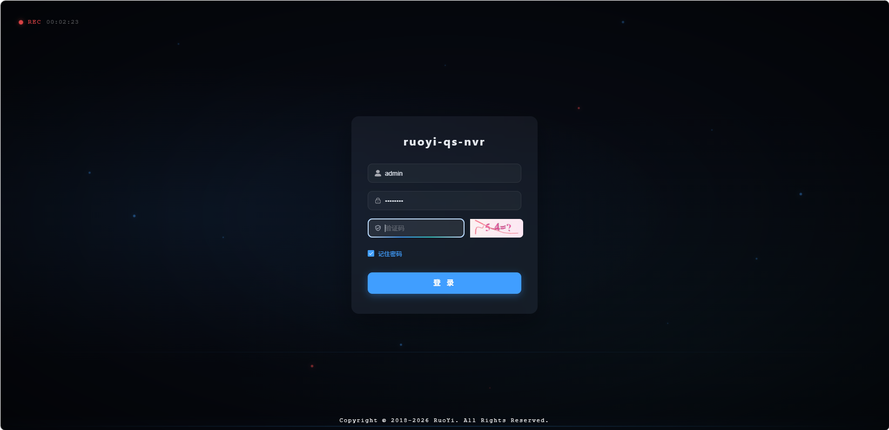</td>
      <td>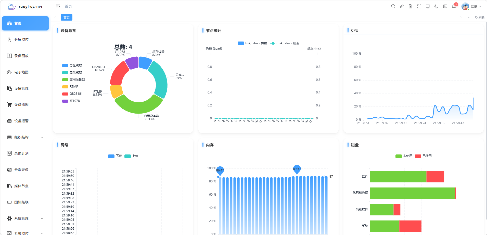</td>
    </tr>
    <tr>
      <td>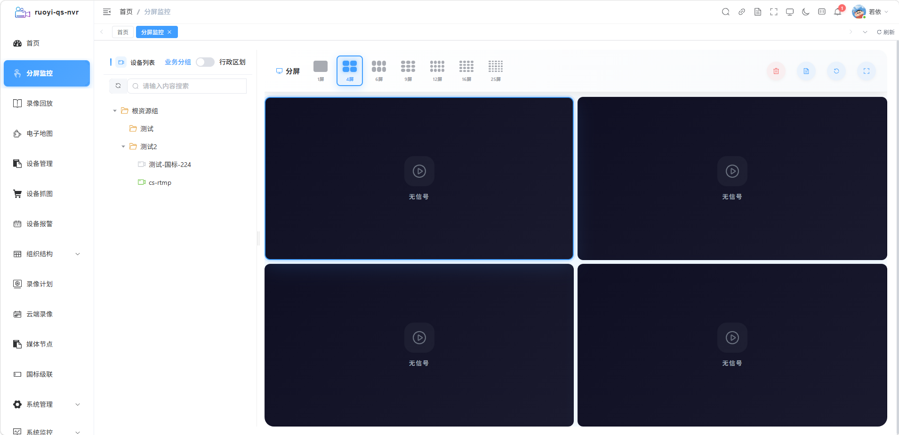</td>
      <td>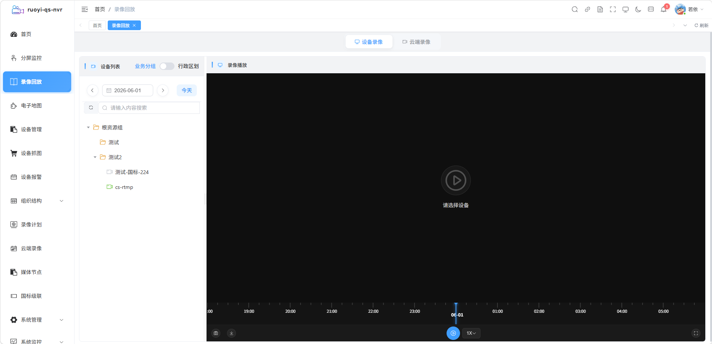</td>
    </tr>
    <tr>
      <td>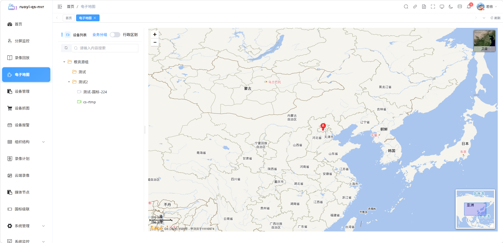</td>
      <td>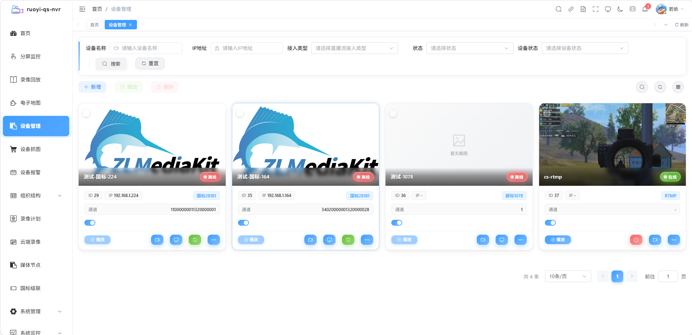</td>
    </tr>
    <tr>
      <td>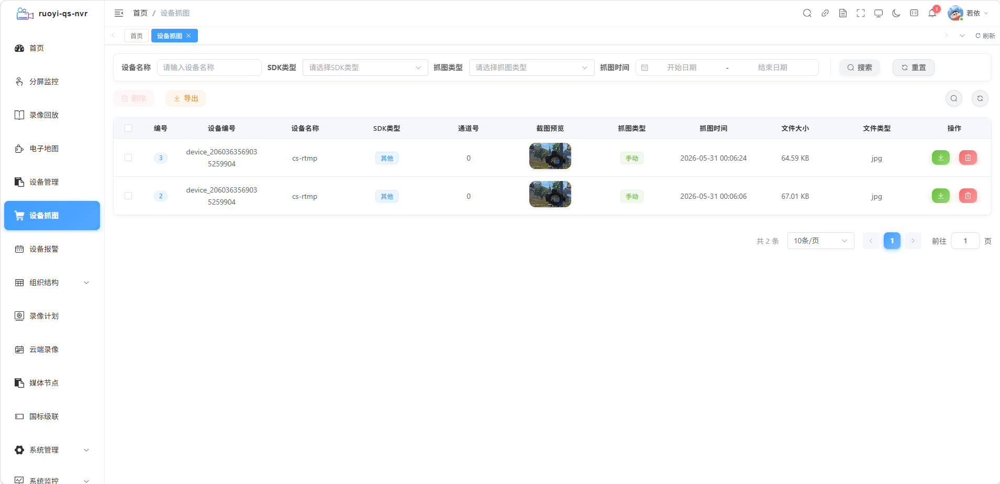</td>
      <td>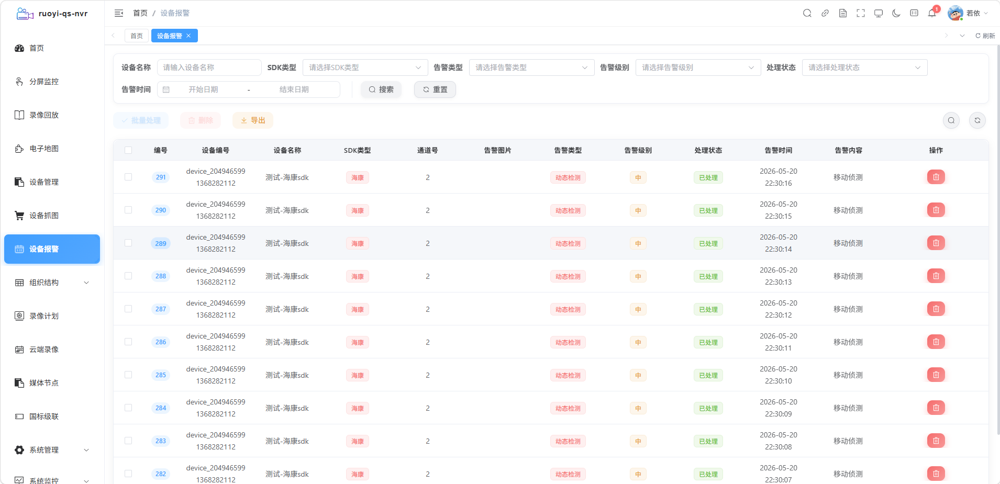</td>
    </tr>
    <tr>
      <td>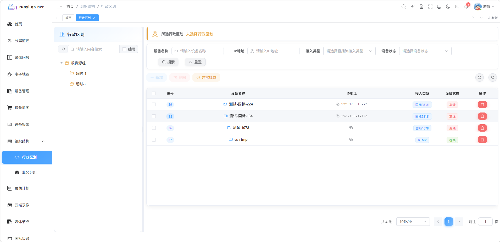</td>
      <td>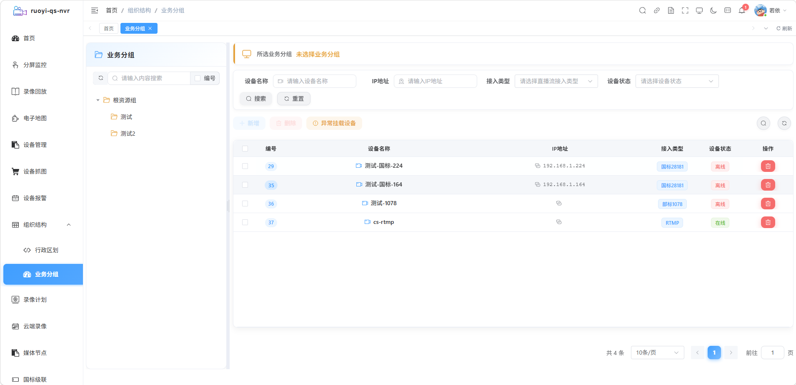</td>
    </tr>
    <tr>
      <td>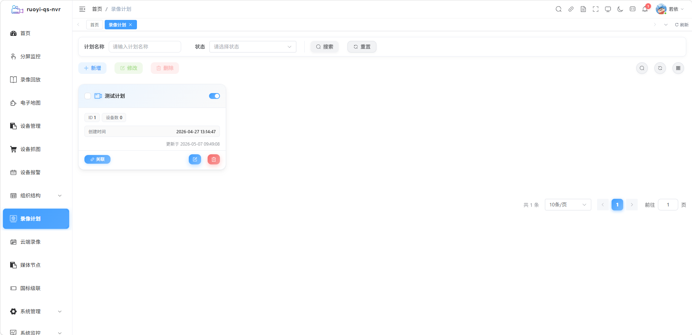</td>
      <td>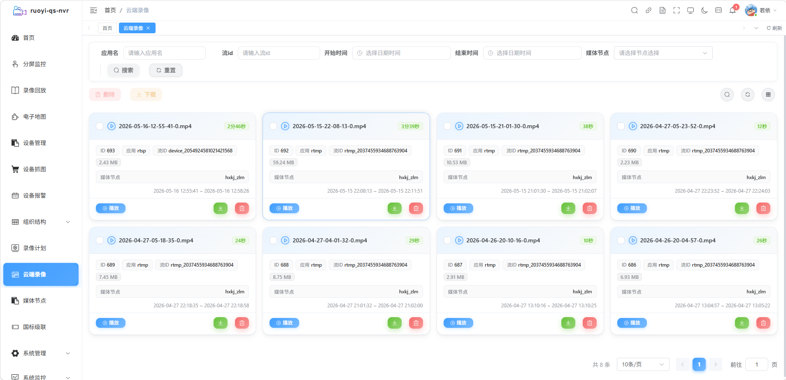</td>
    </tr>
    <tr>
      <td>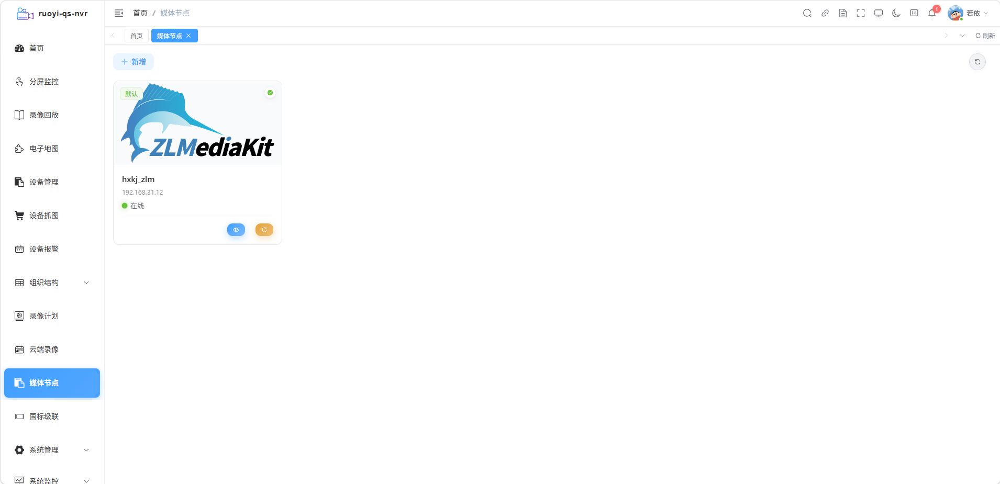</td>
      <td>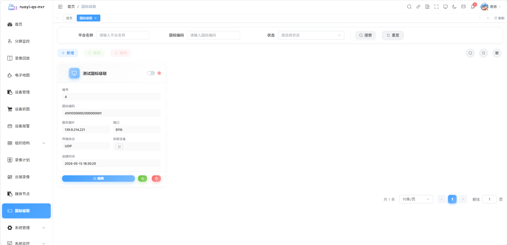</td>
    </tr>
    <tr>
      <td>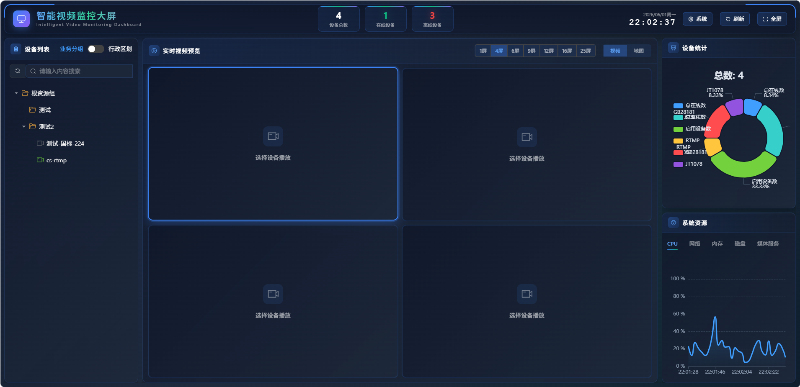</td>
      <td>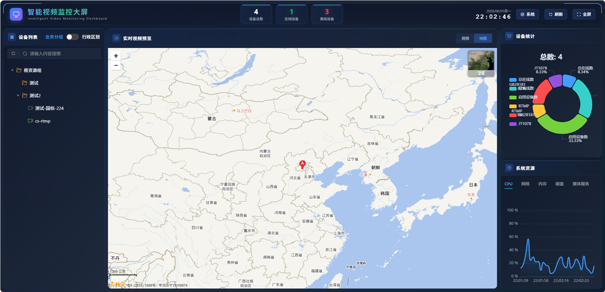</td>
    </tr>
  </table>
</div>

---

## Paid Community

You can also voluntarily join Knowledge Planet for paid consultation:

<div align="center">
  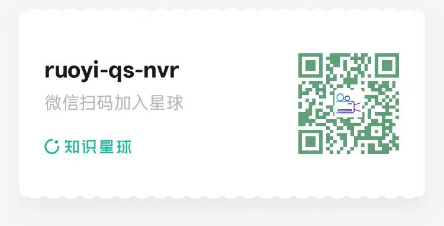
</div>

---

## Acknowledgments

Thanks to the following excellent open-source projects and authors:

- [ZLMediaKit](https://docs.zlmediakit.com/zh/) - Professional streaming server
- [EasyPlayer](https://www.tsingsee.com/) - High-performance player
- [RuoYi Cloud](https://doc.ruoyi.vip/ruoyi-cloud/) - Excellent microservice framework
- [JT808-Server](https://gitee.com/yezhihao/jt808-server) - Industry standard 808/1078 framework
- [WVP-GB28181-PRO](https://gitee.com/pan648540858/wvp-GB28181-pro) - National standard cascade platform
- Thanks to [Pang Hu](https://gitee.com/daofuli) for technical support

---

<div align="center">
  If this project is helpful to you, please give a Star ⭐ to support!

  <br />
  <br />

  Made with ❤️ by Quanshi Team
</div>
